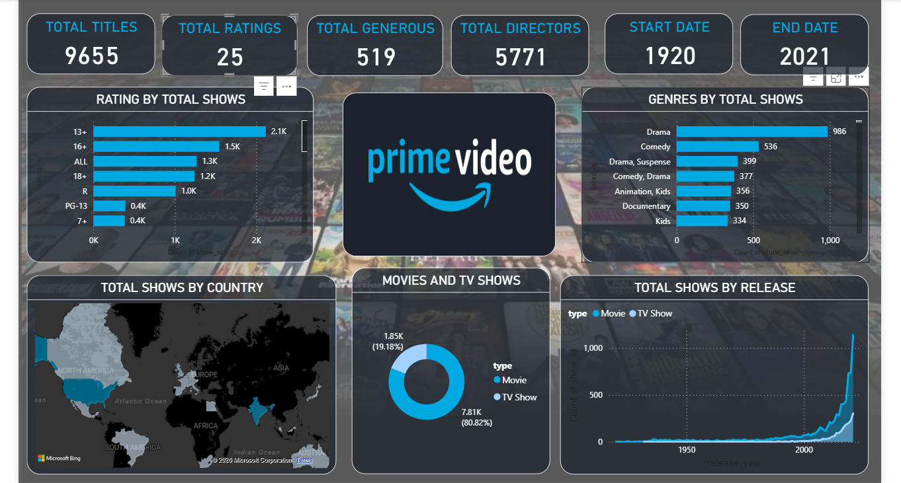

# Amazon Prime Video Dashboard

This project contains an interactive Power BI dashboard created to analyze the movies and TV shows available on Amazon Prime Video.
The dashboard provides insights into content ratings, genres, countries, release years, and the distribution of Movies and TV Shows.

## Dashboard

## About the Dataset

This dataset contains listings of movies and TV shows available on Amazon Prime Video, along with details such as:

- Title
- Type
- Director
- Cast
- Country
- Release Year
- Rating
- Duration
- Genre
- Description

## Dashboard Insights

The dashboard shows:

- Total number of titles
- Movies vs TV Shows
- Ratings distribution
- Popular genres
- Content by country
- Titles by release year

## Tools Used

- Power BI
- Power Query
- DAX

## Dataset Source

Amazon Prime Video Movies and TV Shows dataset.

## Author

**Adithya Gagarin M P**
